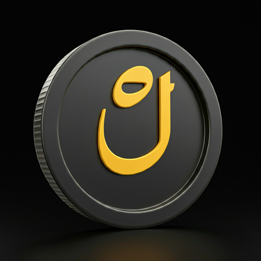

# What is Real (REAL)

REAL is the Shahnameh game's utility token, linked to the Iranian Rial. Starting with 227 tokens, the supply grows with players!

* **Token Name:**
* **Token Blockchain:**
* **Total Supply:**

Upon the official distribution of the $REAL token, the detailed contract address will be announced.

<figure><figcaption></figcaption></figure>

Instead of conducting a ICO Shahnameh will distribute the REAL Supply through airdrops at no cost. a common strategy in the cryptocurrency space, will be utilised to stimulate growth, encourage community development, and reward for early adopters.
